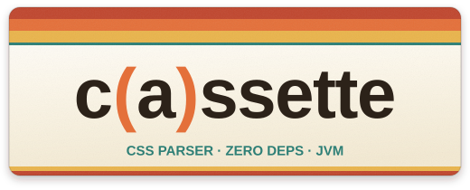

# c(a)ssette

[](https://openjdk.org/projects/jdk/21/)
[](https://junit.org/junit5/)
[](https://jqwik.net/)
[](https://github.com/openjdk/jmh)
[](https://www.graalvm.org/reference-manual/native-image/)
[](LICENSE)
[](https://central.sonatype.com/artifact/dev.nullkitty/cassette)

A fast, dependency-free CSS parser for the JVM.
Recursive descent, spec-faithful error recovery, and a serializer that flattens modern nesting back to CSS 2.x when the target cannot handle it.



## Why this exists

I wanted to learn more about a few things, and just reading about them was not getting me there:

* **Lexing, parsing, creating AST, and how to deal with problems.**\
  The CSS grammar is the well-documented part; what a parser does with broken input is not.

* **Benchmarking: what allocation costs, as opposed to what throughput reports.**\
  A regression that allocates twice as much keeps every test green.
  Using JMH to learn about things like `gc.alloc.rate.norm`, and how to interpret the metric.

* **Whether GraalVM native image earns its place for a CLI.**\
  So far, I've only done Go CLI tools, but I'm a Java developer.
  Exploring AOT with GraalVM seems like a no-brainer.

I learned a lot while building this project.
Here are some of the things I ran into:

* `String.equalsIgnoreCase` is the wrong tool for a CSS name.\
  It folds four non-ASCII characters (like the two uppercase I in the Turkish script) that turn up in `important`, `charset`, `import`, `supports` and `has`, which caused three real misparses here, one of them changing what a stylesheet means.

* What G1 humongous-object is.\
  A token buffer sized from its input might cross the fast path allocation threshold.
  This "failure" is only detectable by monitoring allocation levels.

* The benefits of `jqwik` and property-based testing.\
  One `jqwik` property found two defects that 34 directories of golden fixtures never saw.

Every one of those is invisible until something measures it.
That was supposed to be the whole point of the endeavor.

Well... 15,000 lines of library code and 2,600 of CLI code later, it's a full-fledged CSS tool.
`minify` lands within 0.15% of Bootstrap's own shipped `bootstrap.min.css`, and now we run it in production.

A learning project in production is a fair thing to be suspicious of.
But everything is measured, documented, tested.

## AI disclosure

cassette was written with the help of Claude.

Claude carried most of what is _volume_ rather than _insight_.
The golden-fixture harness, the jqwik properties and the JMH setup are largely its work, as is the boilerplate across the records, and the documents under `docs/` were drafted with it.
It was also the faster half of the optimization loop: proposing what to measure, and writing the benchmark that settled it.

What that does and does not mean for a reader:

* **The measurements are real.**\
  Every figure quoted here comes from the benchmarks I ran on my machine, and `docs/PERFORMANCE.md` records the method behind each one, including the ones that disproved the change that prompted them.

* **The design decisions were made and reviewed by me, a human.**\
  Claude was used as a tool and knowledgebase for things I wanted to know more about, not simply as a code generator for an idea.

---

## Install

```groovy
dependencies {
    implementation 'dev.nullkitty:cassette:1.0.0'
}
```

```xml
<dependency>
  <groupId>dev.nullkitty</groupId>
  <artifactId>cassette</artifactId>
  <version>1.0.0</version>
</dependency>
```

It is a JPMS module, so on the module path:

```java
requires dev.nullkitty.cassette;
```

Java 21 or later, and nothing else: there are no transitive dependencies to exclude.

The command-line tool is not on Maven Central.
It ships as a runnable jar on the [releases page](https://github.com/nullkitty-dev/cassette/releases),
so that the published coordinate stays a library.

## Documents

`docs/` holds the reasoning, one file per area:

| document                                       | owns                                                               |
|------------------------------------------------|----------------------------------------------------------------------|
| [`docs/ARCHITECTURE.md`](docs/ARCHITECTURE.md) | the library: lexer, AST, parser, serializer, public surface        |
| [`docs/PERFORMANCE.md`](docs/PERFORMANCE.md)   | every measured finding, and the method that produced it            |
| [`docs/BUNDLING.md`](docs/BUNDLING.md)         | the coordinate space, `@import` resolution, `SourceIndex`          |
| [`docs/SOURCEMAPS.md`](docs/SOURCEMAPS.md)     | Source Map v3 generation, the writer's rollback paths, `LineIndex` |
| [`docs/CLI.md`](docs/CLI.md)                   | the command-line tool and the native image                         |

The first four record what was decided and why, and link into `PERFORMANCE.md` rather than
repeating a figure.

## Build

```sh
./gradlew build     # compile, javadoc, test
./gradlew test      # tests only
./gradlew jmh       # benchmarks, with the gc profiler on
```

Regenerating golden fixture files, when a serializer change is intentional:

```sh
./gradlew test -Dcassette.fixtures.update=true
```

That run passes unconditionally, so the diff it leaves is the review artifact.

## Layout

```
src/main/java/dev/nullkitty/cassette/
  text/         ASCII case folding, the only kind CSS name matching may do   -> never exported
  lexer/        tokenizer, charset & BOM detection, upfront char[] decode    -> never exported
  ast/          sealed/record AST, Selectors L4 grammar, packed source spans
  diagnostics/  Diagnostic, Severity, SourceResolver, LineIndex
  parser/       recursive descent, CssParser, ParseResult
  serializer/   passthrough & flattened output, optimization pipeline
  bundle/       several sources in one coordinate space, @import resolution
  sourcemap/    Source Map v3, the format model and its encoder

src/test/java/dev/nullkitty/cassette/
  fixtures/     golden-file harness -> src/test/resources/fixtures/README.md
  fuzz/         jqwik generators for CSS-shaped input, plus tokenizer properties

src/jmh/        benchmarks over a vendored real-world corpus
src/cli/        the command-line tool, outside the published library
```

Eight packages, six exported: the tokenizer/parser boundary is internal, and so is the ASCII folding that sits below `ast` so both can reach it.
See [docs/ARCHITECTURE.md](docs/ARCHITECTURE.md) for the reasoning behind each.

## Tokenizer

The `Tokenizer` is a _cursor_, not a stream of objects: the current token lives in fields, and advancing allocates nothing.
Scanning the ~1,000-token benchmark corpus costs **64 B/op**, the cursor itself, against **52 kB/op** if we materialize every token's value.
That ratio is why the AST, not the lexer, is where tokens become records.

```java
Tokenizer tokenizer = new Tokenizer(SourceText.decode(bytes));
while (tokenizer.next() != TokenType.EOF) {
    if (tokenizer.type() == TokenType.AT_KEYWORD && tokenizer.valueEqualsIgnoreCase("media")) { ... }
}
```

Two deliberate departures from [CSS Syntax Level 3](https://www.w3.org/TR/css-syntax-3/):

* **Comments are emitted.**\
  As `TokenType.COMMENT` rather than consumed and discarded, so the passthrough serializer can put them back.

* **Offsets are post-preprocessing.**\
  A BOM is stripped and CRLF collapses to LF before anything is scanned, so token spans index the decoded buffer rather than the original bytes.

Malformed input becomes `BAD_STRING` / `BAD_URL` or a cleared `isTerminated()` flag, and the parser turns each into a `Diagnostic` rather than letting it reach the tree unremarked.

Nothing throws.

## Serializer

Bytes in, CSS out.

The output axes are independent, and `legacyCompatible()` sets all the compatibility-relevant ones at once.
The explicit choice always wins over it, whichever order the two were called in.

```java
Stylesheet ast = CssParser.parse(bytes).ast();

// nested, indented, comments kept
String pretty = CssSerializer.serialize(ast);

// flattened, minified, :is()-wrapped
String small = CssSerializer.serialize(ast, SerializerOptions.builder()
                            .nesting(NestingMode.FLATTEN)
                            .formatting(Formatting.MINIFIED)
                            .build());

// flattened, duplicated instead of :is()-wrapped, ASCII-escaped
String legacy = CssSerializer.serialize(ast, SerializerOptions.builder()
                             .legacyCompatible()
                             .formatting(Formatting.MINIFIED)
                             .build());
```

Minified output removes whitespace and comments and nothing else.
Everything that changes what a stylesheet means is a transform we opt into, run in one pass over the tree:

```java
Stylesheet optimized = Optimizer.optimize(ast, Optimizations.all());
```

Flattening is available on its own, for when we want the flattened tree rather than the text.
Both are tree in, tree out, and neither modifies what it was given:

```java
Stylesheet flat = Flattener.flatten(ast, NestingExpansion.IS_WRAP);
```

Serialization reformats; it does not reproduce.
Comments and nesting survive, but whitespace, quote characters, escape style and whether an attribute value was quoted are the writer's decisions.
The guarantee is that the output is a _fixed point_: parsing and re-serializing it gives back exactly the same text.

Holding that means some values are dropped rather than written wrong: the wreckage a recovered parse leaves behind, and a `url()` whose contents have no spelling the tokenizer reads back the same way.
The parse has already reported the first kind; for the second, an optional sink says so:

```java
List<Diagnostic> lost = new ArrayList<>();
String css = CssSerializer.serialize(ast, options, lost::add);
```

## Bundling

An ordered list of stylesheets becomes one tree in _cascade order_, with each `@import` the caller's importer resolves replaced by the sheet it names:

```java
Importer files = (specifier, from) -> {
    Path path = root.resolve(specifier).normalize();
    return path.startsWith(root)
            ? Optional.of(new Source(path.toString(), Files.readAllBytes(path)))
            : Optional.empty();          // declining leaves the @import in the output
};

BundleResult bundled = Bundler.bundle(
        List.of(new Source("app.css", Files.readAllBytes(app))),
        BundleOptions.builder().importer(files).build());
```

cassette never touches a filesystem, a classpath or a network.
It hands over a specifier and takes bytes back, which is what keeps the importer above to six lines and puts the "never leave this directory" policy where only the caller can state it.
The result is an ordinary `Stylesheet`, so `Flattener`, `Optimizer` and `CssSerializer` take it unchanged.

Every node stays traceable to the file that wrote it: the sources share one _coordinate space_ of character offsets, each parsed at the offset it occupies, and `BundleResult.sourceIndex()` maps any span back:

```java
Origin origin = bundled.sourceIndex().resolve(node.span());   // ("base/buttons.css", 214)
```

**This is the one place `SourceSpan.text` is the wrong tool.**
It slices whatever text it is handed, and in a bundle no single source's text is right for every span, and the offsets stay in range, so the wrong one returns the wrong characters instead of failing.
Use `sourceIndex().textOf(span)`.

Bundling concatenates and inlines; it does not optimize.
Two sources declaring the same thing produce two declarations and the later wins, exactly as concatenating by hand would, and a repeated import is inlined every time because in CSS it genuinely applies twice.
Cycles are cut and named, depth is bounded, and an `@import` stranded by concatenation is hoisted to the front with a warning saying what it moved past.

## Source maps

Source Map Revision 3, one map per serialization.

**The CSS is byte-identical to what `serialize` returns for the same tree and options.**
That is the constraint the whole feature is subordinate to: a development build emits a map and a production build does not, so any byte of difference breaks the premise that what shipped is what was debugged.

```java
SerializeResult result = CssSerializer.serializeWithMap(sheet,
                                                        options,
                                                        SourceResolver.of("app.css", text));

Files.writeString(out, result.css() + "\n" + SourceMap.trailerFor("app.min.css.map"));
Files.writeString(map, result.sourceMap().toJson());
```

The third argument is what turns a span into a file and an offset, since a span is a pair of offsets and does not know which text it indexes.
`SourceResolver.of(name, text)` for one parse and `BundleResult.sourceIndex()` for a bundle is the whole of the difference between mapping one file and mapping seven.

Mappings cover each alternative of a rule's prelude, each declaration and each at-rule, and nothing finer, which is what browser devtools consume for CSS.

**`file`, `sourceRoot` and relative paths belong to the caller.**
The library has no filesystem and cannot compute a path from an output file to a source, so source ids reach `sources` exactly as the resolver named them, both fields are null, and whatever knows both paths fills them in.

Dropping `sourcesContent` is one record rather than an option, and on a 3.6 MB Tailwind build it is 87% of the map's 4.4 MB of JSON:

```java
SourceMap lean = new SourceMap(file, null, map.sources(), null, map.mappings());
```

**And a map need not be built to be written.**
`toJson()` returns a `String`, which for a caller whose next move is a file is 4.4 MB of pure waste, so `writeJson` takes an `Appendable` and streams instead, at **56 kB against 9.6 MB** on that build, a factor of 169, for byte-identical output:

```java
try (Writer file = Files.newBufferedWriter(mapPath, StandardCharsets.UTF_8)) {
    result.sourceMap().writeJson(file);
}
```

Two deliberate omissions.
It is **not a map reader**, so chaining a Sass build's own map is a feature of its own that [docs/SOURCEMAPS.md](docs/SOURCEMAPS.md) records the attachment point for.
And **`names` is always empty**, which is a property of CSS rather than a gap: the array exists for identifier renaming in minified JavaScript.

A span that resolves to no single source is left out rather than guessed at, which for a bundle is ordinary, since a wrapper around a conditional import covers the imported sheet _and everything that sheet imported_, and the rules under it still map.

## Command line

A driver over exactly the calls above, with a flag for every option each of them takes.
It is not part of the published library: it ships as its own jar, holds no CSS knowledge, and can be deleted without touching a line of `src/main`.

```sh
./gradlew cliJar                                     # build/libs/cassette-<version>-cli.jar
./gradlew nativeCompile                              # ...or a native binary, if you have a GraalVM
./gradlew cassette --args='check style.css'          # or run it through Gradle

cassette format style.css                            # re-print, preserving what it means
cassette minify --in-place style.css                 # whitespace and comments, nothing else
cassette check src/*.css                             # diagnostics only, exit 1 on error

cassette minify -O style.css                         # ...and every optimization as well
cassette format -O=shorten-colors style.css          # or just the ones you name

cassette minify --bundle -o app.css src/*.css        # one stylesheet, @import inlined
cassette check --bundle src/app.css                  # validate an import graph, write nothing

cassette minify --source-map -o app.min.css app.css  # ...and app.min.css.map beside it
cassette minify --source-map=inline app.css          # or a data: URI in the trailer
```

`--bundle` makes the inputs one stylesheet in cascade order, which is what makes `-o` legal with several of them, and `--out-dir` and `--in-place` usage errors.

An `@import` resolves only inside an `--import-root`, defaulting to each input's own directory and never over a network; one that resolves to nothing is left in the output with a warning, so a web font survives bundling untouched.

`--source-map` writes `<output>.map` beside the output and names it in a trailing comment.
It needs somewhere to put that file, so `--source-map=file` with the CSS going to a pipe is a usage error rather than a trailer naming something that was never created.
The CLI is what sets `file`, relativizes `sources` and appends the trailer, the three things the library declines to do because it has no filesystem.

`minify` means what `Formatting.MINIFIED` means and nothing else.
Everything that changes what a stylesheet says is `-O`, opt-in under every verb, so `format -O` is a real combination, and a named subset runs in the library's own order rather than yours, because the pass fuses them into one walk.

Diagnostics carry a file, line and column, and go to standard error so that standard output carries CSS and nothing else:

```
style.css:2:18: error: unclosed function rgb(), which consumed everything after it
style.css:2:18: note:   .b { background: rgb(0 0 0; }
```

At a terminal it draws the line instead, with a caret under the span.
`--diagnostic-format` picks, and defaults to whichever suits where the output is going, the same way `--color` does:

```
error: unclosed function rgb(), which consumed everything after it
 --> style.css:2:18
2 | .b { background: rgb(0 0 0; }
  |                  ^^^^^^^^^^^^...
```

The native binary is the same code behind the same flags, and it is worth having because a CLI run is mostly the JVM arriving: `minify` on a 3.6 kB stylesheet takes **5.3 ms** natively against 61 ms through `java -jar`.
The gap narrows with input size and does not close, at 2.7x on a 3.6 MB Tailwind build, because a one-shot process never runs long enough for a JIT to pay back its own startup.

Exit 0 means no errors, 1 an error (or a warning under `--strict`), 2 a usage error and 3 an I/O error.
A nonzero exit does not mean nothing was written: recovery is defined behavior, so a stylesheet with errors still produces output and the errors describe what recovery did to it.
`cassette --help` has the rest.

## Performance

Allocation rate is the tracked metric, not just throughput: a regression that keeps every test green by allocating twice as much is exactly what golden files cannot see.
Parsing Bootstrap 5.3.3 (281 kB) allocates 6.2 MB and takes 2.0 ms.
The whole pipeline, parse then flatten then minify, is 3.3 ms, and 36 ms for a 3.6 MB Tailwind build.
A parsed tree retains 2.3 MB, 8.1x its source.

Stylesheets past about a megabyte are worth one note.
The token buffer is sized from the input, so on a large enough one its arrays cross G1's humongous-object threshold and allocation leaves the fast path, costing 4-6% of a parse on a 3.6 MB build; `-XX:G1HeapRegionSize=32m` or `-XX:+UseParallelGC` recovers it.
Below roughly 1.3 MB nothing crosses the threshold, and bundling many ordinary files never runs into it.

```sh
./gradlew jmh             # the suite, with the gc profiler on
./gradlew memoryCensus    # what a parsed tree retains, by object kind
./gradlew minifyRate      # how much smaller minification makes the corpus
```

[docs/PERFORMANCE.md](docs/PERFORMANCE.md) records every measured finding and the method behind it.

## Minification rate

`./gradlew minifyRate` reports it, on the two real dist builds in the corpus:

|                        |     bytes | of source | gzipped | of source |
|------------------------|----------:|----------:|--------:|----------:|
| Bootstrap 5.3.3 source |   281,046 |       n/a |  33,478 |       n/a |
| `cassette minify`      |   233,162 |     83.0% |  30,933 |     92.4% |
| `cassette minify -O`   |   232,538 | **82.7%** |  30,939 |     92.4% |
| Tailwind 2.2.19 source | 3,642,321 |       n/a | 314,723 |       n/a |
| `cassette minify`      | 2,926,085 |     80.3% | 296,941 |     94.3% |
| `cassette minify -O`   | 2,921,461 | **80.2%** | 296,965 |     94.4% |

**For scale, Bootstrap's own shipped `bootstrap.min.css` is 232,803 B**, so `minify` lands 0.15% above it, `minify -O` 0.11% below, and gzipped at `-9` cassette's is 173 B smaller.
That parity with a mature minifier is the useful comparison; the absolute percentage mostly describes how much whitespace the source had.

Three things the table is deliberately honest about.

**The gzipped column is the one that matters, and it is much less impressive**: 92-94% against 80-83% raw.
Almost everything whitespace removal takes out is redundancy deflate would have found anyway, so the raw figure alone overstates a real transfer saving by roughly three times.

**`-O` is worth almost nothing**, 0.2% raw on Bootstrap and 0.16% on Tailwind, and gzipped it is neutral to _very slightly negative_, because shortening a color removes a repetition deflate was exploiting.
Each transform is opt-in because it changes what a stylesheet says; they do not pay for themselves in bytes either.

**What cassette does not remove is the rest of the gap.**
An empty rule, an empty `@media`, a declaration overridden later in the same rule, two identical rules: all survive, because dropping them is either a semantic judgment or needs a cross-file, cascade-aware view this library does not have.
This one stops where "minify" stops meaning only whitespace.

The corpus is real CSS, fetched rather than committed; see [src/jmh/resources/corpus/README.md](src/jmh/resources/corpus/README.md).

## Specifications

Where the behavior comes from, and which part of it each one settles:

| specification                                                             | what cassette takes from it                                        |
|---------------------------------------------------------------------------|--------------------------------------------------------------------|
| [CSS Syntax Level 3](https://www.w3.org/TR/css-syntax-3/)                 | tokenizing, preprocessing, the parse algorithms and their recovery |
| [Selectors Level 4](https://www.w3.org/TR/selectors-4/)                   | the selector grammar, forgiving lists, specificity                 |
| [CSS Nesting Level 1](https://www.w3.org/TR/css-nesting-1/)               | `&`, relaxed nesting, and what flattening has to undo              |
| [CSS Conditional Rules Level 3](https://www.w3.org/TR/css-conditional-3/) | what a conditional group rule may contain                          |
| [CSS Cascade Level 5](https://www.w3.org/TR/css-cascade-5/)               | `@import` and `@layer`                                             |
| [CSSOM](https://www.w3.org/TR/cssom-1/)                                   | the serializing idioms: identifier and string escaping             |
| [Source Map, ECMA-426](https://tc39.es/ecma426/)                          | the map format, its VLQ mappings and the trailer comment           |
| [WHATWG Encoding](https://encoding.spec.whatwg.org/)                      | the labels `@charset` and a BOM may name, and what they decode to  |

Section numbers cited in the javadoc are against those snapshots, since the editor's drafts renumber.

## Dependency policy

Zero runtime dependencies.
The test and benchmark allowlist is JUnit 5, jqwik, AssertJ and JMH.
Adding to it, and above all adding anything to `api` or `implementation`, is a decision for review rather than a convenience.

## Know what it will not do

cassette is not a replacement for a browser engine or a build pipeline.
There is no cascade, no computed values and no CSSOM, and each of those is a stated non-goal rather than a gap waiting to be filled.
Reaching for it to answer "what color is this element" is reaching for the wrong tool.

What it gives us instead is narrow and dependable: a tree where every node knows which byte of which file it came from, recovery that matches what a browser does with the same broken input, and a serializer whose output is a fixed point of its own round trip.
If that is the shape of the problem, `CssParser.parse(bytes)` is the whole of the setup.

