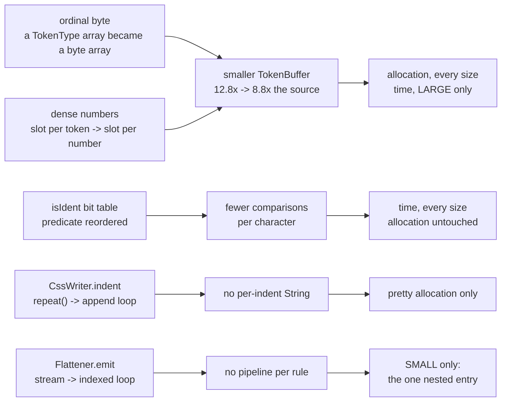

# Benchmark baselines

JMH results kept in git, because that is the only place they survive.

| file                             | what it covers                                                             |
|----------------------------------|----------------------------------------------------------------------------|
| [`baseline.json`](baseline.json) | the full suite, 29 benchmarks in 87 rows, 2 forks x 5 iterations, `v1.0.0` |

Measured 2026-08-29, overnight, on a machine doing nothing else.
That last part is not a detail, and the trap below says what it cost the run this file replaced.
Name the tag when replacing it, since the file itself records the JDK and the VM but not the tree.
A tag rather than a commit, because a commit is only as durable as the history it sits in.

One file, because this run covers every benchmark including `SourceMapBenchmark`.
The split that used to sit here existed only while the full suite's map rows predated the change that removed 64 bytes of allocation per mapping.

Both were measured on the same machine, JDK, VM and flag set: Apple M5 Pro (5P+10E), 24 GB, macOS 26.6 arm64, Temurin 21.0.11.
Comparing across machines is not meaningful.
Comparing across trees on one machine mostly is.
A full run takes about three hours.

## Results live outside `build/`

`./gradlew jmh` writes `jmh-results/`, which is gitignored, and never into `build/`.

That is not tidiness.
`build/` is a directory anything is entitled to empty: `clean` does it on request, and Gradle's own stale-output cleanup does it _unasked_ whenever it decides `.gradle/buildOutputCleanup` no longer describes the contents.
Two completed runs were lost that way, the second after printing `BUILD SUCCESSFUL` and writing its results, with nobody having run anything that should have removed them.
"Remember to copy it" was never a safeguard.

Alongside `results.json`, which the next run overwrites, a run writes `<date>-<commit>.json`, which nothing overwrites.
Promoting one into this directory is a copy with no naming decision in it:

```sh
caffeinate -i ./gradlew jmh 2>&1 | tee /tmp/jmh.log    # ~3 h, full corpus
cp jmh-results/<the archived file> benchmarks/baseline.json
```

**Keep the `tee`.**
It is cheap, and it is what saved the allocation figures from one of the lost runs.
But a log carries every mean and error bar and no `rawData`, so nothing in it can support a timing claim.
A log is much better than prose and much worse than a baseline.

## What belongs here

**Full runs only.**
A filtered full run counts: `-Pjmh.include` and `-Pjmh.corpus` are exact, and the run is still full rigor.
Say what it covered.

**A quick run does not.**
`-Pjmh.quick` is one fork with one-second iterations.
The build writes it to `results-quick.json` where it cannot be mistaken for a baseline.
A run at non-standard rigor archives itself as `<date>-<commit>-2x20.json` for the same reason.
A second run on the same day at the same commit takes `-2`, `-3` and so on, rather than replacing the first.

## Reading a result

Six traps, in the order they have cost time.

**`-Pjmh.quick` is a "did this get dramatically worse" check and nothing finer.**
One fork means the error bar describes three iterations of a single JIT profile, not the variance between profiles.
Three quick runs of identical code have spread 2.2% while each reported +/-60 B/op.
A 10% quick-mode delta is real; a 2% one is not.

**Never compare a quick figure against a file in this directory**, allocation included.
That is the comparison that looks safe and is the one that catches people out.
`gc.alloc.rate.norm` degrades _less_ under a short run than timing does, and "less" is not "not at all".
On `SerializeBenchmark.optimize` at LARGE the same tree reads 4,775,950 B/op full and 4,923,132 B/op quick, +3.1%, reproducible to within ten bytes across separate JVM launches on both sides, and indistinguishable from a regression.
Some benchmarks show no gap at all (`pretty` on SMALL and MEDIUM matched its full-run figure to seven bytes), which is exactly what makes the ones that do dangerous: there is no way to tell from the number itself.

So a quick-mode delta needs a quick-mode baseline, built from the tree being compared against:

```sh
mkdir -p /tmp/base && git archive <commit> | tar -x -C /tmp/base
cp src/jmh/resources/corpus/*.css /tmp/base/src/jmh/resources/corpus/   # gitignored, so copy them
cd /tmp/base && ./gradlew jmh -Pjmh.quick -Pjmh.corpus=LARGE -Pjmh.include='Some.benchmark$'
```

`git archive` rather than a worktree, so the repository gains no state.
A SMALL-only differential needs no corpus copy, because the handwritten entry is tracked and `Corpus` opens each entry on demand.

Better still, do the differential at full rigor.
`-Pjmh.forks` and `-Pjmh.iterations` exist for it, and a filtered pair costs minutes rather than hours:

```sh
cd /tmp/base && ./gradlew jmh -Pjmh.include='SerializeBenchmark.legacy$' -Pjmh.corpus=SMALL \
                              -Pjmh.forks=2 -Pjmh.iterations=20
```

That is how the largest changes here were established, and it is the right tool whenever this suite's cross-run drift is larger than the effect, which for anything under about 10% on timing it is.
**Raise `forks` to ask "is this real" and `iterations` to ask "how big":** iterations tighten the bar inside one JIT profile, forks sample more profiles, and profile-to-profile spread is what bites.
**Anchor an `-Pjmh.include` pattern with `$`**, since `ParseBenchmark.parse` also matches `parseText`, `parseAndSerialize` and `parseOptimizeAndSerialize`.

**A full run on a machine being used for anything else is not a baseline.**
Three full runs settled this, all at 2 forks x 5 iterations, the last two on trees whose only executable difference is one static map's initial capacity in code no benchmark reaches.

```text
                vs the oldest run:  median      mean |delta|    worst
run 2, machine in use               +2.22%         6.17%        +54.4%
run 3, machine idle (this file)     -0.75%         2.85%        +18.0%
```

The rows run 2 inflated most are the ones run 3 gave back: `ParseBenchmark.parseText` at SMALL went +54% then -38%, `SerializeBenchmark.flattened` at LARGE +25% then -21%.
Nothing in the tree explains either move.

Allocation did not care.
Across those same two runs `gc.alloc.rate.norm` has a median difference of 0.001%, and the eight rows above 1% are all `OptionalWrapperBenchmark`, where the absolute figure rounds to zero bytes.

So: run the suite on an idle machine, and when comparing two files in this directory, trust allocation and treat timing as the weaker claim.

**Read a timing delta against `primaryMetric.rawData`, not against `scoreError`.**
Two forks disagreeing by 17% and averaging to a tight-looking number happens here regularly.
`parseAndSerialize` on MEDIUM has read 4,261 us +/-1,555, which is one fork at a tight 3,319 and the other at a loose 5,202: two compilation plans, not one number.
`optimize` on MEDIUM has degraded _within_ a single fork, iterations running 252, 252, 251, 324, 447.
The MEDIUM serializer and pipeline family is the unreliable one; LARGE is where the forks agree.

**Timings drift about 8% between runs on code nothing touched**, and on the serializer and tokenizer families a single run has carried +/-20%.
`DecodeBenchmark.decodeUtf8` on LARGE has moved +8.2% and -12.8% on a path no change could reach, both forks agreeing on both sides.
**A sub-5% timing delta between two runs is not evidence.**

**And `gc.alloc.rate.norm` is not deterministic between JVM launches.**
This is the sharpest one, because allocation is the metric the project tracks and was assumed to be exempt.
`SerializeBenchmark.minified` on LARGE is **multi-modal in steps of 70,272 bytes**, one grow-copy of the output buffer, established by measuring outside JMH against two trees and watching both hit both modes.
It has since been seen at 409,672 B on MEDIUM, +19.5%, on a path the change under test could not reach, byte-exact within each run, on a verified-identical JDK, VM and flag set.
Nothing here explains why a deterministic capacity estimate lands on a different side of a growth boundary in a different JVM launch.

Two consequences, and the second is a rule:

* **A tiny `scoreError` says the forks agreed, not that the number is deterministic.**\
  Two forks landing the same way is not rare.
  It is stable _within_ a JVM, so every iteration of a fork agrees.
* **An absolute allocation figure is not comparable across files in this directory at all.**\
  Not merely at sub-percent resolution.
  What survives is a difference taken _inside_ one run.

That rule is what makes the source-map figures below trustworthy: the control carrying the same buffer term in the same run cancels it exactly.

## What the measurements established

Four changes account for almost all of the movement, and the useful part is that they are not the same kind of win.
Figures are Tailwind (3.64 MB, the LARGE entry) unless stated.

| Tailwind, LARGE             | before   | after        |           |
|-----------------------------|----------|--------------|-----------|
| `tokenize` time             | 24.5 ms  | 8.6 ms       | **2.84x** |
| `parse` time                | 41.7 ms  | 23.5 ms      | **1.77x** |
| parse -> serialize pipeline | 51.9 ms  | 34.4 ms      | **1.51x** |
| `tokenize` allocation       | 47.1 MB  | **32.6 MB**  | -30.9%    |
| `parse` allocation          | 99.1 MB  | **84.3 MB**  | -14.9%    |
| pipeline allocation         | 131.8 MB | **117.2 MB** | -11.1%    |

Per change, and the zeroes matter as much as the wins:

| allocation, LARGE                         | ordinal byte | dense numbers | `isIdent` table + writer fixes |
|-------------------------------------------|--------------|---------------|--------------------------------|
| `tokenize`                                | -9.3%        | **-23.8%**    | -0.0%                          |
| `parse`                                   | -4.8%        | **-10.4%**    | -0.3%                          |
| pipeline                                  | -3.3%        | -8.0%         | -0.0%                          |
| `pretty`                                  | -0.2%        | +0.2%         | **-13.1%**                     |
| `minified`, `decodeUtf8`, `decodeAndScan` | 0.0%         | 0.0%          | 0.0%                           |

| time, LARGE                    | ordinal byte | dense numbers | `isIdent` table + writer fixes |
|--------------------------------|--------------|---------------|--------------------------------|
| `tokenize`                     | -57.0%       | -1.8%         | **-16.7%**                     |
| `parse`                        | **-38.2%**   | -2.5%         | -6.4%                          |
| `scan`, which builds no buffer | +1.2%        | -0.8%         | **-18.6%**                     |
| pipeline                       | **-24.6%**   | -7.3%         | -5.2%                          |

### Three mechanisms, and the suite separates them



The two `TokenBuffer` changes bought time by buying allocation, and only above a size threshold.
Their arrays are G1-humongous on multi-megabyte input and ordinary below it, which is why Tailwind gained 1.77x while Bootstrap gained 4.6%.
Parsing Tailwind as one file against the same bytes cut into seven is the direct measurement of that, and the ratio fell from **1.94x to 1.12x** and then stopped moving once the buffer stopped crossing the threshold.
That is the shape the diagnosis predicted and a general tokenizing win would not, so it is a claim that could have been falsified and was not.

The `isIdent` table bought time without touching allocation, and `TokenizeBenchmark.scan` isolates it better than a deliberate control would have: it allocates 64 B/op and never builds a buffer, so neither allocation change could reach it, and the predicate change had nowhere to hide.
Its LARGE time held at 7.53, 7.62, 7.56 ms across three trees and then fell to **6.15**.

The writer changes are visible only where they apply.
`pretty` is the only serializer benchmark that is not `MINIFIED`, so it took the whole of the indent win.
`flattened` and `legacy` moved on SMALL alone, because that is the only corpus entry containing a `&`, which also means the corpus is a thin witness for them and the real figure is probably larger.

And the controls never moved.
`decodeUtf8`, `decodeAndScan`, `minified` and `asciiEscaped` allocation are identical to 0.0% across every run.
Every change landed where its write-up claimed and nowhere else, which is what makes the attribution above safe rather than plausible.

### Bootstrap did not get faster, and that is not a disappointment

| Bootstrap (281 kB), MEDIUM | before  | after   |            |
|----------------------------|---------|---------|------------|
| `parse` time               | 1.92 ms | 1.83 ms | -4.6%      |
| `parse` allocation         | 7.29 MB | 6.16 MB | **-15.4%** |
| `tokenize` allocation      | 3.66 MB | 2.54 MB | **-30.7%** |

Allocation fell as far as it did on Tailwind while time barely moved.
Bootstrap never crosses the humongous threshold, so the two buffer changes had no time win to give it, and what it did gain is the `isIdent` table.
**A 281 kB stylesheet parses in under two milliseconds and always did.**
The performance work was about what happens above a megabyte, and about bytes rather than seconds everywhere else.

### What a source map costs

`SourceMapBenchmark` measures against its own maps-off `minified` case, in the same class and the same run, which is the only comparison the drift rule permits.

| against serialize-only                        | Bootstrap (MEDIUM) | Tailwind (LARGE) |
|-----------------------------------------------|--------------------|------------------|
| `withMap`, built and not rendered             | +43.1% allocation  | +68.9%           |
| `withMapToJson`, what writing a sidecar costs | +133.0%            | **+130.7%**      |
| `withMapToJsonWithoutContent`                 | +47.8%             | +76.3%           |

So a rendered map with content costs about 2.3x what serializing allocates, and `sourcesContent` is the dominant term, which is what `--no-source-map-content` removes.

Locating a span used to cost 64 bytes per mapping, and now costs none.
Bootstrap's build term, `withMap - minified`, went **905,224 -> 353,416 B**, and the total lands on an exact 64.000 bytes x 8,622 mappings.
It was two independent allocations, removed separately and each confirmed by its own full run:

* **16 B, a capturing lambda.**\
  `MapPass` used `computeIfAbsent`, whose lambda captures the location and is allocated per mapping whether the map hits or misses.
  A `get` and a null test is the same semantics for a single-threaded walk.
  Three corpus sizes spanning three orders of magnitude agreed to 1.4 points.
* **48 B, an allocation inside a `try`.**\
  `SourceResolver.tryLocate`'s default form catches `IndexOutOfBoundsException`, and an allocation inside a `try` is not scalar-replaced, so the `Optional` and the `Location` both reached the heap on _every_ call, including all the ones that succeeded.
  An override that range-checks instead removed both.
  Isolated rather than inferred: putting the `try` body back reads 767,277 B against the range check's 353,416.

That measurement is the cleanest in this directory, because for once the control moved **exactly zero bytes**: three map benchmarks fell by the same amount to within 28 bytes over a `minified` that did not budge.
A later run reproduced the result byte-for-byte on two of three sizes.

The method lesson is worth more than the figure.
The 48 B had been recorded as the largest single term in building a map, constructed as arithmetic over a measured total rather than as two measured terms, and it was short by one object, because nothing had counted the lambda.
A term measured in total and attributed by arithmetic is two claims wearing one number's clothes.
Worse, the first attempt to fix that replaced a correct attribution with a wrong one, on the strength of a microbenchmark whose locator allocated _outside_ a `try` where the shipping one did not.
A model differing from the code in one unnoticed way is worse than no model, because it answers confidently.

### `Optional` at a returning boundary

`OptionalWrapperBenchmark` prices the wrapper against a nullable twin differing in nothing else.
It takes no corpus, parameterizing on a hit rate instead, so **`-Pjmh.corpus` must not be passed with it**, since that property sets a benchmark parameter it does not declare, and it is the one class runnable without fetching either gitignored corpus entry.

Every allocation figure is an exact integer with a `scoreError` of **zero**: 0, 2,048, 4,096, 6,144, 8,192, 12,288 B/op at 256 calls per op.
That is not a measurement with tight bars but arithmetic the JIT either performs or does not, and which is the point of the class.

An `Optional` at a monomorphic boundary is free until the call site sees both answers, and then it is exactly 16 B, because `Optional.of` and the `empty()` singleton meet at a phi that forces the fresh one to materialize.
**None of those zeroes survive a `try`**, which is the condition the class does not model and the one that mattered on the maps-on path.
Treat its rows as the ceiling for a wrapper the JIT can see through, not as a prediction about a particular call site.

Its timings describe the benchmark rather than the library, with one informative pair: `locateWithoutCapture` against `locateViaNullable`, identical but for the capture, at **3,038 +/- 124 against 3,746 +/- 73 ns/op**, non-overlapping.

## Open observations

Two things recorded rather than explained, both of which want the next run's attention.

The MEDIUM serializer allocation mode flipped and has stayed flipped.
`SerializeBenchmark.minified` and `SourceMapBenchmark.minified` on MEDIUM both read **2,510,625 B** against an earlier **2,100,953 B**, +19.50%, on a path nothing since touches, holding to the byte across three consecutive runs and two benchmark classes.
`asciiEscaped` on MEDIUM moved with them, +19.18%, while `pretty` did not move at all.
`pretty` staying put while both MINIFIED cases moved points at the output buffer's growth boundary rather than at anything in the tree, but nothing here establishes that.

The largest allocation term is one nothing has touched.
`SerializeBenchmark.minified` allocates **15.48 MB on Tailwind** to produce a few megabytes of CSS, identical in every run.
That is the `StringBuilder` growth series plus the final `toString`, and every `CssSerializer.serialize` overload returns a `String`.
It is the same shape `SourceMap.toJson` had before `writeJson(Appendable)` cut it by [a factor of 169](../docs/PERFORMANCE.md#tojson-and-the-two-things-measuring-it-found), and unlike that case it is on the path every caller walks.
Recorded rather than proposed: an `Appendable` overload is a public addition.

## The suite

29 benchmarks, 87 rows at three corpus entries.
`SourceMapBenchmark` contributes four and `OptionalWrapperBenchmark` five.

Corpus: Bootstrap 5.3.3 (281 kB) and Tailwind 2.2.19 (3.64 MB), per [the corpus README](../src/jmh/resources/corpus/README.md).
Two of the three entries are gitignored; fetch them before running, or the suite silently measures the 3.6 kB handwritten entry alone.
